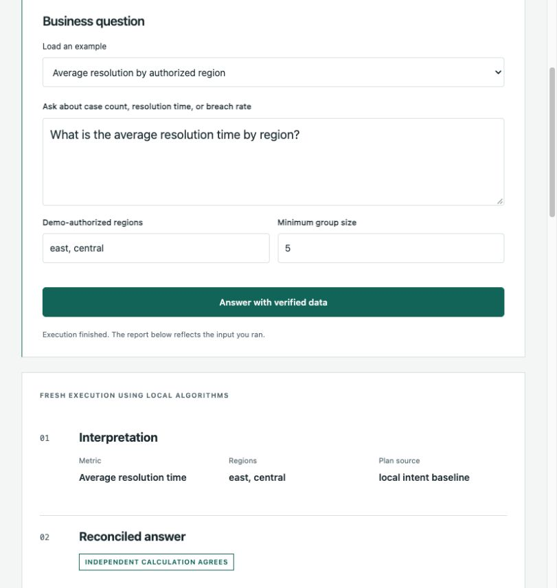

# Governed Analytics Workbench



A semantic-query workspace that explains, reconciles and controls every released aggregate.

[Open application](https://Snuthakki21.github.io/governed-analytics-workbench/) · [Architecture](docs/ARCHITECTURE.md) · [Domain contracts](docs/DOMAIN_CONTRACTS.md) · [Runbook](docs/PRODUCT_RUNBOOK.md) · [Tests](tests) · [Historical independent review](projects/governed_analytics/independent-staff-review.md)

[](https://github.com/Snuthakki21/governed-analytics-workbench/actions/workflows/ci.yml)

Natural-language analytics becomes risky when a planner invents a filter, changes a metric, queries outside the intended scope or discloses a small group. This application separates interpretation from metric ownership, query execution and disclosure policy so each boundary has an inspectable contract.

## Start the application

Python 3.11 or later is supported. The calculation engine uses the standard library. From a source checkout:

```sh
python3 -m portfolio serve
```

Open `http://127.0.0.1:8765`. Load an example, adjust domain controls or import JSON, run the calculation and inspect its evidence. The public application executes the same Python product code in a browser worker. Browser records stay in that browser; the native workspace uses a local SQLite store. Neither deployment implies a shared authenticated cloud service.

For an auditable file-to-file run:

```sh
python3 -m portfolio run governed_analytics --input examples/base.json --output reports/result.json
python3 -m unittest discover -s tests -v
```

The domain engine accepts an input object and returns a structured report. The workspace adds scenario revisions, execution history, comparisons and review records. [Running guide](docs/RUNNING.md) covers platform commands, storage and packaging. [Model integration](docs/MODEL_INTEGRATION.md) covers optional providers; public browser execution requires no model key.

## User workflows

### 1. Ask an operational question

Choose one metric—case volume, average resolution time or breach rate—and optionally group by region or team. Scope the query to allowed regions. Supported vocabulary is deliberately bounded and unsupported filters are rejected.

### 2. Inspect the semantic contract

Review the registered metric expression, version, unit, grain and null policy. The query explanation shows the selected region parameters and every validation, reconciliation and disclosure step.

### 3. Resolve ambiguity safely

A request containing multiple metrics, unsupported dates, individual records or unknown groupings receives an explicit clarification error before data access. The planner evaluation exposes accepted and refused examples.

### 4. Validate released results

Inspect read-only parameterized SQL, independent Python reconciliation, minimum group size and complementary suppression. Quality diagnostics operate only on released groups and do not add hidden counts.

## Implemented capabilities

| Capability | Behavior |
|---|---|
| AI tool architecture | Optional model-generated semantic plan; generated SQL is never accepted and the plan must preserve the deterministic request interpretation. |
| Semantic governance | Versioned MetricDefinition entities and a MetricCatalog define expressions, units, ownership, grain and null policy. |
| Data access controls | Explicit region scope, fixed identifiers and parameter-bound values prevent the planner from widening the query. |
| Independent reconciliation | Every SQL aggregate is recomputed from authorized records before release. |
| Disclosure controls | Primary and complementary suppression withhold undersized groups and avoid publishing revealing totals. |
| Planner evaluation | Executable positive, ambiguity, temporal-filter, individual-data and unsupported-grouping regression cases. |

## Application structure

The project entry point is a compatibility adapter, not a second engine. Domain rules, application orchestration and AI components live in separate modules with direct unit coverage.

| Component | Responsibility |
|---|---|
| [`app/domain/catalog.py`](app/domain/catalog.py) | MetricDefinition and MetricCatalog own the semantic layer. |
| [`app/ai/planner.py`](app/ai/planner.py) | Bounded natural-language parser and structured model-plan schema. |
| [`app/domain/authorization.py`](app/domain/authorization.py) | Validates scope and proves the generated plan preserves the request. |
| [`app/domain/records.py`](app/domain/records.py) | Enforces record types, valid regions, unique identifiers and numeric bounds. |
| [`app/domain/query.py`](app/domain/query.py) | VerifiedQueryEngine builds allowlisted SQL and independently reconciles results. |
| [`app/domain/disclosure.py`](app/domain/disclosure.py) | DisclosurePolicy applies primary and complementary suppression. |
| [`app/ai/evaluation.py`](app/ai/evaluation.py) | PlanContract and PlanEvaluation explain the plan and execute interpretation regressions. |
| [`app/application/product.py`](app/application/product.py) | ProductApplication controls the authorized query and release workflow. |
| `app/platform/` | Workspace persistence, scenario versions, execution history, comparisons and review audit. |
| `web/` | Domain-specific interface, editable controls, report rendering and browser workspace. |
| `tests/` | Domain unit/regression tests plus runtime, API, package and interface verification. |
| `examples/` | Complete synthetic inputs and an executed report. |

## Input and output contract

| Input | Contract |
|---|---|
| `request` | 1–2,000 characters; exactly one supported metric, region/team/none grouping, and at most one explicit region. |
| `allowed_regions` | Nonempty unique subset of east, central and west. This is a caller-selected workspace scope, not authenticated identity. |
| `minimum_group_size` | Integer from 5 to 10,000; small groups can trigger complementary suppression of another group. |
| `records` | 1–10,000 records with unique id, region, team, resolution_minutes and Boolean breached. |

Reports retain `summary`, `metrics`, `evidence`, `next_actions` and full `details`. The execution layer adds provenance. Downloads contain complete result arrays even where the interface shows a bounded preview. Inputs are validated before optional model calls; invalid data fails explicitly rather than generating a partial success.

## Verification

Unknown query terms, unsupported time windows, mixed metrics, multiple regions, scope widening, wrong planner groupings, malformed records, modified SQL aggregates and small groups are covered by executable negative tests.

Domain suites: [`tests/test_governed_analytics.py`](tests/test_governed_analytics.py), [`tests/test_semantic_product.py`](tests/test_semantic_product.py), [`tests/test_operations_independent.py`](tests/test_operations_independent.py). Existing independent regression tests are retained. New experiment tests verify repeatability, boundary conditions and calculations against independently expressed expectations. The historical review covers the prior implementation; expanded-source review and current CI evidence must be assessed separately.

```sh
python3 -m venv .venv
.venv/bin/python -m pip install -r requirements-dev.txt
.venv/bin/python -m coverage run -m unittest discover -s tests -v
.venv/bin/python -m coverage report
python3 -m portfolio build --output dist
node --test tests/frontend.test.mjs
```

Coverage is a regression signal, not proof of correctness or production readiness. Runtime tests use controlled provider doubles unless a report explicitly records a real provider run.

## Boundaries and operating assumptions

- The current semantic catalog contains three well-defined operational metrics. It does not silently approximate unsupported questions or accept arbitrary SQL.
- Caller-selected regions demonstrate enforcement of a scope contract; they are not a substitute for identity-backed authorization in a multi-user service.
- Small-group suppression does not prevent all inference or differencing attacks across query histories. No differential-privacy guarantee is claimed.
- The built-in language regression suite evaluates the deterministic interpreter. It is not a measured accuracy benchmark for a live provider. Original records are synthetic.

## Documentation

- [Architecture and decisions](docs/ARCHITECTURE.md)
- [Domain and AI contracts](docs/DOMAIN_CONTRACTS.md)
- [Product runbook](docs/PRODUCT_RUNBOOK.md)
- [Requirements and verification map](docs/REQUIREMENTS.md)
- [Security policy](SECURITY.md)
- [Third-party notices](docs/THIRD_PARTY.md)

All examples are original synthetic fixtures. No employer, customer or confidential operational data is included.

## Persistent workspace

The interface includes a versioned scenario library, execution history, exact input/result replay, outcome comparison and evidence reviews. GitHub Pages persists records in this browser; the native server uses SQLite with optimistic revisions, idempotent execution reservations and a verifiable audit chain. Application and workspace data remain independent of every other repository.

See [workspace workflows, installation, container, backup and recovery](docs/WORKSPACE.md), [HTTP API contracts](docs/API.md), [domain Staff Engineer review](docs/STAFF_REVIEW_V2.md), [platform Staff Engineer review](docs/STAFF_PLATFORM_REVIEW.md), and [measured validation](docs/VALIDATION.md).
