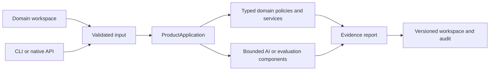

# Architecture — Governed Analytics Workbench

## Execution boundaries

ProductApplication is the use-case boundary. Public project adapters preserve the original callable API while delegating behavior to the application package. Browser execution packages the same domain code and uses no server-side model credentials. The native service can use optional configured model providers through the shared bounded runtime.

## Component ownership

- `app/domain/catalog.py`: MetricDefinition and MetricCatalog own the semantic layer.
- `app/ai/planner.py`: Bounded natural-language parser and structured model-plan schema.
- `app/domain/authorization.py`: Validates scope and proves the generated plan preserves the request.
- `app/domain/records.py`: Enforces record types, valid regions, unique identifiers and numeric bounds.
- `app/domain/query.py`: VerifiedQueryEngine builds allowlisted SQL and independently reconciles results.
- `app/domain/disclosure.py`: DisclosurePolicy applies primary and complementary suppression.
- `app/ai/evaluation.py`: PlanContract and PlanEvaluation explain the plan and execute interpretation regressions.
- `app/application/product.py`: ProductApplication controls the authorized query and release workflow.

## Architectural decisions

### ADR-01: Constrain the planner to a semantic object

**Decision.** The query engine owns SQL. A probabilistic planner can propose only registered metric, grouping and region identifiers.

### ADR-02: Reject ambiguous requests

**Decision.** Guessing a metric or discarding a filter would produce a polished but misleading answer. The user must choose a supported interpretation.

### ADR-03: Use two calculations

**Decision.** SQLite results are checked against a separate Python implementation, catching query mistakes before disclosure.

### ADR-04: Evaluate only released outputs

**Decision.** Diagnostic summaries must not undo suppression by disclosing raw totals or hidden group sizes.

## State and reproducibility

The domain calculation is isolated from workspace storage and does not mutate the input object. A saved scenario revision is an input artifact; an execution result binds that input to code provenance and calculated evidence. Review state belongs to the workspace, not to an implicit approval by a model. Browser storage and native SQLite storage are separate deployments and are not synchronized automatically.

## Trust boundaries

JSON input is untrusted. Domain validators enforce bounded sizes and numeric values. A configured model is untrusted output: semantic plans or narrative source identifiers must satisfy their contracts. The domain calculation controls facts and decisions. Importing a file never grants identity-backed access or executes arbitrary code.
