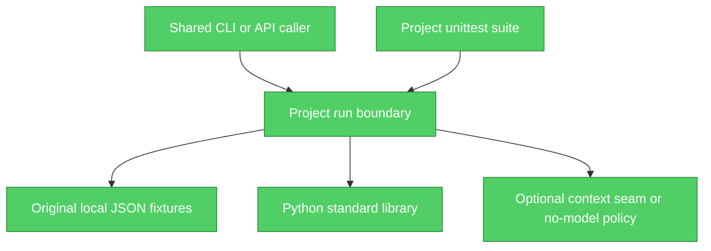

# Engineering review: Governed Operations Analytics

This records the actual author-side checks and plugin-guided contributions. It is a self-review, not the independent Staff Engineer audit requested for delivery. The independent review is a separate artifact supplied by a non-authoring reviewer.

## Brooks-Lint Architecture Audit

**Scope:** This project module, original fixture, and its unit tests. Shared runtime internals and other applications are outside this author-side audit. No project-specific Brooks configuration was present. **Health Score: 100/100 after repairs** (structural assessment only; this is not a security, production-readiness or test score).

### Module Dependency Graph



### Findings

No unresolved structural finding in this bounded scope. The module imports only `json, pathlib, re, sqlite3, math, copy`. There is no project-to-project import or circular dependency. The program has one domain purpose and one public run boundary; its DTO-style inputs are an intentional boundary contract. An in-memory SQLite dependency in analytics is a local adapter decision, not an external service dependency. Optional context.generate_json bounded-plan interface.

The review scanned dependency disorder, domain-model distortion, duplicated decisions, accidental complexity, change propagation and cognitive load. Guard clauses and linear orchestration were retained where they make trust boundaries visible. No factories, provider hierarchy or agent framework were added. The testability seam is the explicit context parameter; local deterministic behavior is tested without network access. Team structure beyond this personal portfolio is unknown, so no Conway's Law claim is made.

Resolved correctness observations:

- A malformed model plan could supply a list where a metric string was required. Added explicit string validation before allowlist membership.
- Added a deliberately corrupted SQL-result test to prove independent reconciliation refuses to release a wrong result.

The reasoning follows *Code Complete* defensive construction, *The Pragmatic Programmer* orthogonality, and *Working Effectively with Legacy Code* seams where those principles match the concrete observations. Similar small validators across independently deployable bounded projects are not treated as an automatic DRY violation.

## Ponytail ultra contribution

The implementation stops at the standard library and a small explicit workflow. It reuses the shared provider seam instead of creating another client. Known simplification ceilings are marked with `ponytail:` comments in code. User-requested security validation, tests and thorough documentation are retained. No speculative distributed service, database deployment or autonomous orchestration was added.

## Claude Octopus coverage audit

Detected convention: Python standard-library `unittest`, `tests/test_<project_id>.py`, xUnit classes and built-in assertions. This audit prioritized fewer than 30 high-risk behavior groups and generated fewer than 20 test methods for this project. The inventory below maps asserted outcomes and failure boundaries; it is not a claim that one method equals one branch.

| # | Behavior group | Type | Test method | Assessment |
|---|---|---|---|---|
| 1 | expected scoped average and reconciliation | error/guard | `test_expected_scoped_average_and_reconciliation` | Behavior asserted |
| 2 | changed metric changes result | conditional/outcome | `test_changed_metric_changes_result` | Behavior asserted |
| 3 | changed records change average | conditional/outcome | `test_changed_records_change_average` | Behavior asserted |
| 4 | out of scope region rejected | error/guard | `test_out_of_scope_region_rejected` | Behavior asserted |
| 5 | small groups and complement are suppressed | conditional/outcome | `test_small_groups_and_complement_are_suppressed` | Behavior asserted |
| 6 | all small groups release nothing | conditional/outcome | `test_all_small_groups_release_nothing` | Behavior asserted |
| 7 | exact group boundary releases | error/guard | `test_exact_group_boundary_releases` | Behavior asserted |
| 8 | unrecognized ambiguous or sql request rejected | error/guard | `test_unrecognized_ambiguous_or_sql_request_rejected` | Behavior asserted |
| 9 | invalid rows and disclosure size rejected | error/guard | `test_invalid_rows_and_disclosure_size_rejected` | Behavior asserted |
| 10 | live plan is bounded and validated | integration | `test_live_plan_is_bounded_and_validated` | Behavior asserted |
| 11 | malicious live plans rejected | error/guard | `test_malicious_live_plans_rejected` | Behavior asserted |
| 12 | none planner uses local intent and preserves input | integration | `test_none_planner_uses_local_intent_and_preserves_input` | Behavior asserted |
| 13 | no authorized rows releases nothing | conditional/outcome | `test_no_authorized_rows_releases_nothing` | Behavior asserted |
| 14 | additional boundary and grouping cases | error/guard | `test_additional_boundary_and_grouping_cases` | Behavior asserted |
| 15 | corrupt query result fails closed | error/guard | `test_corrupt_query_result_fails_closed` | Behavior asserted |

```text
SELECTED BEHAVIORS: 15/15 mapped to assertions
UNIT TEST METHODS: 15 passing
MEASURED STATEMENT + BRANCH COVERAGE, FINAL REVIEW RUN: 97.46%
```

Coverage was run with `coverage run --branch --source=projects.governed_analytics -m unittest tests.test_governed_analytics` as part of the four-project author test run. Across these four modules, 64 author tests and 18 independent review tests passed (82 total). Liquidity's sole uncovered line is the internal arithmetic-conservation exception; normal and stressed conservation outcomes are checked across every bucket. Analytics retains three redundant guard error branches already intercepted by earlier vocabulary/scope validation; these are reported as uncovered, not excluded from measurement. No coverage percentage implies that all economic assumptions or live model behavior have been validated.

## Development Skills staff-review status

The staff-review skill was read. Its required `development-skills:staff-reviewer` dispatch target was not present as a callable local agent definition in the installed package. That specific dispatch was not claimed. A factual author-side trace checked the requested project contract, run behavior, invalid inputs and current unit results. A non-authoring operations agent completed the independent automated review and rechecked the author corrections. See [independent-staff-review.md](independent-staff-review.md) for its source hash, reproductions and bounded PASS verdict.

## Accepted scope limits

- Caller-provided scope is demonstrative, not authentication. Production identity integration is expressly absent.
- Complementary small-group suppression reduces a specific disclosure path but is not differential privacy or a repeated-query defense.

These are published application limits, not silently waived production requirements. See the README for input/output, operations, test procedure, alternatives and production work.

## Final cross-review follow-through

Independent review prompted a strict documented vocabulary, rejection of unsupported filters, deterministic preservation of metric/grouping/region across live proposals, and range-first rejection of huge numeric inputs. Author subcases also reject invalid permitted-token combinations and command punctuation.

Final measured coverage includes the author suite and `tests/test_operations_independent.py`; it does not imply a real model benchmark. Reviewed implementation SHA-256: `06c758cdb068871df88be8b101e83aa0f99537a99cab66af0f8b90f760c79ae4`.
